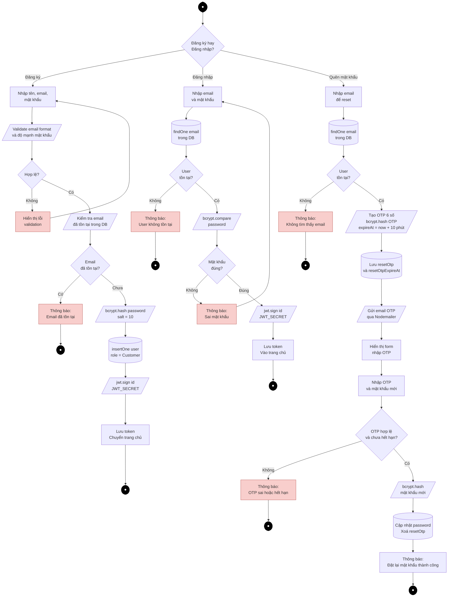

```mermaid
flowchart TD
    Start([●]) --> A{Đăng ký hay\nĐăng nhập?}

    %% ===== ĐĂNG KÝ =====
    A -->|Đăng ký| B[Nhập tên, email,\nmật khẩu]
    B --> C[/Validate email format\nvà độ mạnh mật khẩu/]
    C --> D{Hợp lệ?}
    D -->|Không| E[Hiển thị lỗi\nvalidation]
    E --> B
    D -->|Có| F[/Kiểm tra email\nđã tồn tại trong DB/]
    F --> G{Email\nđã tồn tại?}
    G -->|Có| H[Thông báo:\nEmail đã tồn tại]
    H --> End1([●])
    G -->|Chưa| I[/bcrypt.hash password\nsalt = 10/]
    I --> J[(insertOne user\nrole = Customer)]
    J --> K[/jwt.sign id\nJWT_SECRET/]
    K --> L[Lưu token\nChuyển trang chủ]
    L --> End2([●])

    %% ===== ĐĂNG NHẬP =====
    A -->|Đăng nhập| M[Nhập email\nvà mật khẩu]
    M --> N[(findOne email\ntrong DB)]
    N --> O{User\ntồn tại?}
    O -->|Không| P[Thông báo:\nUser không tồn tại]
    P --> End3([●])
    O -->|Có| Q[/bcrypt.compare\npassword/]
    Q --> R{Mật khẩu\nđúng?}
    R -->|Không| S[Thông báo:\nSai mật khẩu]
    S --> M
    R -->|Đúng| T[/jwt.sign id\nJWT_SECRET/]
    T --> U[Lưu token\nVào trang chủ]
    U --> End4([●])

    %% ===== QUÊN MẬT KHẨU =====
    A -->|Quên mật khẩu| V[Nhập email\nđể reset]
    V --> W[(findOne email\ntrong DB)]
    W --> X{User\ntồn tại?}
    X -->|Không| Y[Thông báo:\nKhông tìm thấy email]
    Y --> End5([●])
    X -->|Có| Z[/Tạo OTP 6 số\nbcrypt.hash OTP\nexpireAt = now + 10 phút/]
    Z --> AA[(Lưu resetOtp\nvà resetOtpExpireAt)]
    AA --> AB[/Gửi email OTP\nqua Nodemailer/]
    AB --> AC[Hiển thị form\nnhập OTP]
    AC --> AD[Nhập OTP\nvà mật khẩu mới]
    AD --> AE{OTP hợp lệ\nvà chưa hết hạn?}
    AE -->|Không| AF[Thông báo:\nOTP sai hoặc hết hạn]
    AF --> End6([●])
    AE -->|Có| AG[/bcrypt.hash\nmật khẩu mới/]
    AG --> AH[(Cập nhật password\nXoá resetOtp)]
    AH --> AI[Thông báo:\nĐặt lại mật khẩu thành công]
    AI --> End7([●])

    %% Styling
    style Start fill:#000,color:#fff,stroke:#000
    style End1 fill:#000,color:#fff,stroke:#fff
    style End2 fill:#000,color:#fff,stroke:#fff
    style End3 fill:#000,color:#fff,stroke:#fff
    style End4 fill:#000,color:#fff,stroke:#fff
    style End5 fill:#000,color:#fff,stroke:#fff
    style End6 fill:#000,color:#fff,stroke:#fff
    style End7 fill:#000,color:#fff,stroke:#fff
    style E fill:#f8cecc,stroke:#b85450
    style H fill:#f8cecc,stroke:#b85450
    style P fill:#f8cecc,stroke:#b85450
    style S fill:#f8cecc,stroke:#b85450
    style Y fill:#f8cecc,stroke:#b85450
    style AF fill:#f8cecc,stroke:#b85450
```
