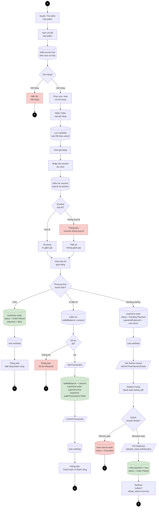

```mermaid
flowchart TD
    Start([●]) --> A[Duyệt / Tìm kiếm\nsản phẩm]
    A --> B[Xem chi tiết\nsản phẩm]
    B --> C[(Kiểm tra tồn kho\ntheo size và màu)]
    C --> D{Còn hàng?}
    D -->|Hết hàng| E[Hiển thị:\nHết hàng]
    E --> End1([●])
    D -->|Còn hàng| F[Chọn size, màu\nvà số lượng]
    F --> G[Nhấn Thêm\nvào giỏ hàng]
    G --> H[(Lưu cartData\nvào DB theo userId)]
    H --> I[Xem giỏ hàng]
    I --> J[Nhập mã voucher\ntuỳ chọn]
    J --> K[(Kiểm tra voucher\nhợp lệ và isActive)]
    K --> L{Voucher\nhợp lệ?}
    L -->|Không hợp lệ| M[Thông báo:\nVoucher không hợp lệ]
    M --> N[Tiếp tục\nkhông giảm giá]
    L -->|Hợp lệ| O[Áp dụng\n% giảm giá]
    O --> P[Chọn địa chỉ\ngiao hàng]
    N --> P
    P --> Q{Phương thức\nthanh toán?}

    %% ===== COD =====
    Q -->|COD| R[(insertOne order\nstatus = Order Placed\npayment = false)]
    R --> S[(Xoá cartData)]
    S --> T[Thông báo:\nĐặt hàng thành công]
    T --> End2([●])

    %% ===== VÍ ĐIỆN TỬ =====
    Q -->|Ví điện tử| U[(Kiểm tra\nwalletBalance ≥ amount)]
    U --> V{Số dư\nđủ?}
    V -->|Không đủ| W[Thông báo:\nSố dư không đủ]
    W --> End3([●])
    V -->|Đủ| X[/startTransaction/]
    X --> Y[(walletBalance -= amount\ninsertOne order payment=true\ninsertOne walletTransaction Debit)]
    Y --> Z[/commitTransaction/]
    Z --> AA[(Xoá cartData)]
    AA --> AB[Thông báo:\nThanh toán Ví thành công]
    AB --> End4([●])

    %% ===== BANKING SEPAY =====
    Q -->|Banking SePay| AC[(insertOne order\nstatus = Pending Payment\npaymentExpiresAt = now+5min)]
    AC --> AD[(Xoá cartData)]
    AD --> AE[/Tạo SePay invoice\ninitOneTimePaymentFields/]
    AE --> AF[Redirect trang\nthanh toán SePay QR]
    AF --> AG{Khách\nchuyển khoản?}
    AG -->|Hết thời gian| AH[(Auto-cancel order\nstatus = Cancelled)]
    AH --> End5([●])
    AG -->|Đã thanh toán| AI[/IPN Webhook\nORDER_PAID APPROVED/]
    AI --> AJ[(order.payment = true\nstatus = Order Placed)]
    AJ --> AK[Redirect\n/orders?sepay_status=success]
    AK --> End6([●])

    %% Styling
    style Start fill:#000,color:#fff,stroke:#000
    style End1 fill:#000,color:#fff,stroke:#fff
    style End2 fill:#000,color:#fff,stroke:#fff
    style End3 fill:#000,color:#fff,stroke:#fff
    style End4 fill:#000,color:#fff,stroke:#fff
    style End5 fill:#000,color:#fff,stroke:#fff
    style End6 fill:#000,color:#fff,stroke:#fff
    style E fill:#f8cecc,stroke:#b85450
    style M fill:#f8cecc,stroke:#b85450
    style W fill:#f8cecc,stroke:#b85450
    style AH fill:#f8cecc,stroke:#b85450
    style R fill:#d5e8d4,stroke:#82b366
    style Y fill:#d5e8d4,stroke:#82b366
    style AJ fill:#d5e8d4,stroke:#82b366
```
