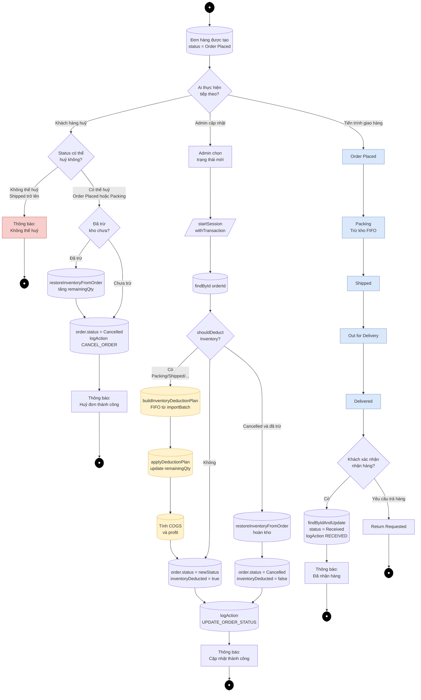

```mermaid
flowchart TD
    Start([●]) --> A[(Đơn hàng được tạo\nstatus = Order Placed)]
    A --> B{Ai thực hiện\ntiếp theo?}

    %% ===== KHÁCH HUỶ ĐƠN =====
    B -->|Khách hàng huỷ| C{Status có thể\nhuỷ không?}
    C -->|Không thể huỷ\nShipped trở lên| D[Thông báo:\nKhông thể huỷ]
    D --> End1([●])
    C -->|Có thể huỷ\nOrder Placed hoặc Packing| E{Đã trừ\nkho chưa?}
    E -->|Đã trừ| F[(restoreInventoryFromOrder\ntăng remainingQty)]
    F --> G[(order.status = Cancelled\nlogAction CANCEL_ORDER)]
    E -->|Chưa trừ| G
    G --> H[Thông báo:\nHuỷ đơn thành công]
    H --> End2([●])

    %% ===== ADMIN CẬP NHẬT =====
    B -->|Admin cập nhật| I[Admin chọn\ntrạng thái mới]
    I --> J[/startSession\nwithTransaction/]
    J --> K[(findById orderId)]
    K --> L{shouldDeduct\nInventory?}
    L -->|Có\nPacking/Shipped/...| M[(buildInventoryDeductionPlan\nFIFO từ importBatch)]
    M --> N[(applyDeductionPlan\nupdate remainingQty)]
    N --> O[(Tính COGS\nvà profit)]
    O --> P[(order.status = newStatus\ninventoryDeducted = true)]
    L -->|Không| P
    L -->|Cancelled và đã trừ| Q[(restoreInventoryFromOrder\nhoàn kho)]
    Q --> R[(order.status = Cancelled\ninventoryDeducted = false)]
    P --> S[(logAction\nUPDATE_ORDER_STATUS)]
    R --> S
    S --> T[Thông báo:\nCập nhật thành công]
    T --> End3([●])

    %% ===== VÒNG ĐỜI TRẠNG THÁI =====
    B -->|Tiến trình giao hàng| U[Order Placed]
    U --> V[Packing\nTrừ kho FIFO]
    V --> W[Shipped]
    W --> X[Out for Delivery]
    X --> Y[Delivered]
    Y --> Z{Khách xác nhận\nnhận hàng?}
    Z -->|Có| AA[(findByIdAndUpdate\nstatus = Received\nlogAction RECEIVED)]
    AA --> AB[Thông báo:\nĐã nhận hàng]
    AB --> End4([●])
    Z -->|Yêu cầu trả hàng| AC[Return Requested]
    AC --> End5([●])

    %% Styling
    style Start fill:#000,color:#fff,stroke:#000
    style End1 fill:#000,color:#fff,stroke:#fff
    style End2 fill:#000,color:#fff,stroke:#fff
    style End3 fill:#000,color:#fff,stroke:#fff
    style End4 fill:#000,color:#fff,stroke:#fff
    style End5 fill:#000,color:#fff,stroke:#fff
    style D fill:#f8cecc,stroke:#b85450
    style U fill:#dae8fc,stroke:#6c8ebf
    style V fill:#dae8fc,stroke:#6c8ebf
    style W fill:#dae8fc,stroke:#6c8ebf
    style X fill:#dae8fc,stroke:#6c8ebf
    style Y fill:#dae8fc,stroke:#6c8ebf
    style M fill:#fff2cc,stroke:#d6b656
    style N fill:#fff2cc,stroke:#d6b656
    style O fill:#fff2cc,stroke:#d6b656
```
