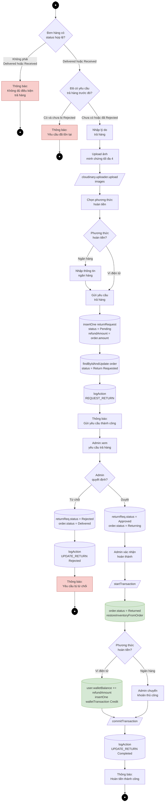

```mermaid
flowchart TD
    Start([●]) --> A{Đơn hàng có\nstatus hợp lệ?}
    A -->|Không phải\nDelivered hoặc Received| B[Thông báo:\nKhông đủ điều kiện\ntrả hàng]
    B --> End1([●])
    A -->|Delivered hoặc Received| C{Đã có yêu cầu\ntrả hàng trước đó?}
    C -->|Có và chưa bị Rejected| D[Thông báo:\nYêu cầu đã tồn tại]
    D --> End2([●])
    C -->|Chưa có hoặc đã Rejected| E[Nhập lý do\ntrả hàng]
    E --> F[Upload ảnh\nminh chứng tối đa 4]
    F --> G[/cloudinary.uploader.upload\nimages/]
    G --> H[Chọn phương thức\nhoàn tiền]
    H --> I{Phương thức\nhoàn tiền?}
    I -->|Ngân hàng| J[Nhập thông tin\nngân hàng]
    J --> K[Gửi yêu cầu\ntrả hàng]
    I -->|Ví điện tử| K
    K --> L[(insertOne returnRequest\nstatus = Pending\nrefundAmount = order.amount)]
    L --> M[(findByIdAndUpdate order\nstatus = Return Requested)]
    M --> N[(logAction\nREQUEST_RETURN)]
    N --> O[Thông báo:\nGửi yêu cầu thành công]
    O --> P[Admin xem\nyêu cầu trả hàng]
    P --> Q{Admin\nquyết định?}

    %% ===== TỪ CHỐI =====
    Q -->|Từ chối| R[(returnReq.status = Rejected\norder.status = Delivered)]
    R --> S[(logAction\nUPDATE_RETURN Rejected)]
    S --> T[Thông báo:\nYêu cầu bị từ chối]
    T --> End3([●])

    %% ===== DUYỆT =====
    Q -->|Duyệt| U[(returnReq.status = Approved\norder.status = Returning)]
    U --> V[Admin xác nhận\nhoàn thành]
    V --> W[/startTransaction/]
    W --> X[(order.status = Returned\nrestoreInventoryFromOrder)]
    X --> Y{Phương thức\nhoàn tiền?}
    Y -->|Ví điện tử| Z[(user.walletBalance += refundAmount\ninsertOne walletTransaction Credit)]
    Z --> AA[/commitTransaction/]
    Y -->|Ngân hàng| AB[Admin chuyển\nkhoản thủ công]
    AB --> AA
    AA --> AC[(logAction\nUPDATE_RETURN Completed)]
    AC --> AD[Thông báo:\nHoàn tiền thành công]
    AD --> End4([●])

    %% Styling
    style Start fill:#000,color:#fff,stroke:#000
    style End1 fill:#000,color:#fff,stroke:#fff
    style End2 fill:#000,color:#fff,stroke:#fff
    style End3 fill:#000,color:#fff,stroke:#fff
    style End4 fill:#000,color:#fff,stroke:#fff
    style B fill:#f8cecc,stroke:#b85450
    style D fill:#f8cecc,stroke:#b85450
    style T fill:#f8cecc,stroke:#b85450
    style Z fill:#d5e8d4,stroke:#82b366
    style X fill:#d5e8d4,stroke:#82b366
```
