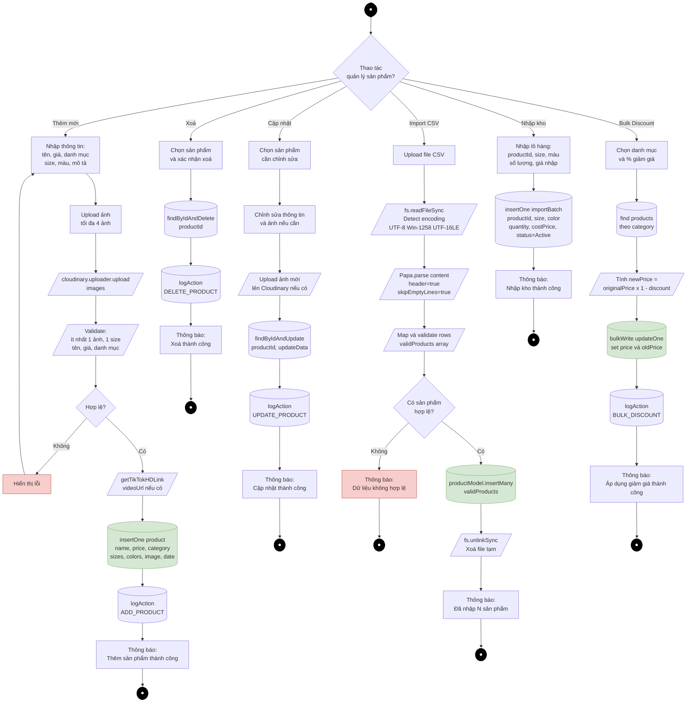

```mermaid
flowchart TD
    Start([●]) --> A{Thao tác\nquản lý sản phẩm?}

    %% ===== THÊM SẢN PHẨM =====
    A -->|Thêm mới| B[Nhập thông tin:\ntên, giá, danh mục\nsize, màu, mô tả]
    B --> C[Upload ảnh\ntối đa 4 ảnh]
    C --> D[/cloudinary.uploader.upload\nimages/]
    D --> E[/Validate:\nít nhất 1 ảnh, 1 size\ntên, giá, danh mục/]
    E --> F{Hợp lệ?}
    F -->|Không| G[Hiển thị lỗi]
    G --> B
    F -->|Có| H[/getTikTokHDLink\nvideoUrl nếu có/]
    H --> I[(insertOne product\nname, price, category\nsizes, colors, image, date)]
    I --> J[(logAction\nADD_PRODUCT)]
    J --> K[Thông báo:\nThêm sản phẩm thành công]
    K --> End1([●])

    %% ===== CẬP NHẬT =====
    A -->|Cập nhật| L[Chọn sản phẩm\ncần chỉnh sửa]
    L --> M[Chỉnh sửa thông tin\nvà ảnh nếu cần]
    M --> N[/Upload ảnh mới\nlên Cloudinary nếu có/]
    N --> O[(findByIdAndUpdate\nproductId, updateData)]
    O --> P[(logAction\nUPDATE_PRODUCT)]
    P --> Q[Thông báo:\nCập nhật thành công]
    Q --> End2([●])

    %% ===== XOÁ =====
    A -->|Xoá| R[Chọn sản phẩm\nvà xác nhận xoá]
    R --> S[(findByIdAndDelete\nproductId)]
    S --> T[(logAction\nDELETE_PRODUCT)]
    T --> U[Thông báo:\nXoá thành công]
    U --> End3([●])

    %% ===== IMPORT CSV =====
    A -->|Import CSV| V[Upload file CSV]
    V --> W[/fs.readFileSync\nDetect encoding\nUTF-8 Win-1258 UTF-16LE/]
    W --> X[/Papa.parse content\nheader=true\nskipEmptyLines=true/]
    X --> Y[/Map và validate rows\nvalidProducts array/]
    Y --> Z{Có sản phẩm\nhợp lệ?}
    Z -->|Không| AA[Thông báo:\nDữ liệu không hợp lệ]
    AA --> End4([●])
    Z -->|Có| AB[(productModel.insertMany\nvalidProducts)]
    AB --> AC[/fs.unlinkSync\nXoá file tạm/]
    AC --> AD[Thông báo:\nĐã nhập N sản phẩm]
    AD --> End5([●])

    %% ===== GIẢM GIÁ HÀNG LOẠT =====
    A -->|Bulk Discount| AE[Chọn danh mục\nvà % giảm giá]
    AE --> AF[(find products\ntheo category)]
    AF --> AG[/Tính newPrice =\noriginalPrice x 1 - discount/]
    AG --> AH[(bulkWrite updateOne\nset price và oldPrice)]
    AH --> AI[(logAction\nBULK_DISCOUNT)]
    AI --> AJ[Thông báo:\nÁp dụng giảm giá thành công]
    AJ --> End6([●])

    %% ===== NHẬP KHO =====
    A -->|Nhập kho| AK[Nhập lô hàng:\nproductId, size, màu\nsố lượng, giá nhập]
    AK --> AL[(insertOne importBatch\nproductId, size, color\nquantity, costPrice, status=Active)]
    AL --> AM[Thông báo:\nNhập kho thành công]
    AM --> End7([●])

    %% Styling
    style Start fill:#000,color:#fff,stroke:#000
    style End1 fill:#000,color:#fff,stroke:#fff
    style End2 fill:#000,color:#fff,stroke:#fff
    style End3 fill:#000,color:#fff,stroke:#fff
    style End4 fill:#000,color:#fff,stroke:#fff
    style End5 fill:#000,color:#fff,stroke:#fff
    style End6 fill:#000,color:#fff,stroke:#fff
    style End7 fill:#000,color:#fff,stroke:#fff
    style G fill:#f8cecc,stroke:#b85450
    style AA fill:#f8cecc,stroke:#b85450
    style I fill:#d5e8d4,stroke:#82b366
    style AB fill:#d5e8d4,stroke:#82b366
    style AH fill:#d5e8d4,stroke:#82b366
```
