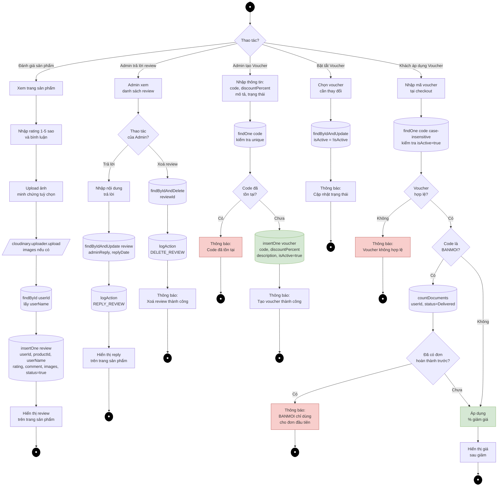

```mermaid
flowchart TD
    Start([●]) --> A{Thao tác?}

    %% ===== ĐÁNH GIÁ SẢN PHẨM =====
    A -->|Đánh giá sản phẩm| B[Xem trang sản phẩm]
    B --> C[Nhập rating 1-5 sao\nvà bình luận]
    C --> D[Upload ảnh\nminh chứng tuỳ chọn]
    D --> E[/cloudinary.uploader.upload\nimages nếu có/]
    E --> F[(findById userId\nlấy userName)]
    F --> G[(insertOne review\nuserId, productId, userName\nrating, comment, images, status=true)]
    G --> H[Hiển thị review\ntrên trang sản phẩm]
    H --> End1([●])

    %% ===== ADMIN TRẢ LỜI REVIEW =====
    A -->|Admin trả lời review| I[Admin xem\ndanh sách review]
    I --> J{Thao tác\ncủa Admin?}
    J -->|Trả lời| K[Nhập nội dung\ntrả lời]
    K --> L[(findByIdAndUpdate review\nadminReply, replyDate)]
    L --> M[(logAction\nREPLY_REVIEW)]
    M --> N[Hiển thị reply\ntrên trang sản phẩm]
    N --> End2([●])
    J -->|Xoá review| O[(findByIdAndDelete\nreviewId)]
    O --> P[(logAction\nDELETE_REVIEW)]
    P --> Q[Thông báo:\nXoá review thành công]
    Q --> End3([●])

    %% ===== ADMIN TẠO VOUCHER =====
    A -->|Admin tạo Voucher| R[Nhập thông tin:\ncode, discountPercent\nmô tả, trạng thái]
    R --> S[(findOne code\nkiểm tra unique)]
    S --> T{Code đã\ntồn tại?}
    T -->|Có| U[Thông báo:\nCode đã tồn tại]
    U --> End4([●])
    T -->|Chưa| V[(insertOne voucher\ncode, discountPercent\ndescription, isActive=true)]
    V --> W[Thông báo:\nTạo voucher thành công]
    W --> End5([●])

    %% ===== ADMIN BẬT TẮT VOUCHER =====
    A -->|Bật tắt Voucher| X[Chọn voucher\ncần thay đổi]
    X --> Y[(findByIdAndUpdate\nisActive = !isActive)]
    Y --> Z[Thông báo:\nCập nhật trạng thái]
    Z --> End6([●])

    %% ===== KHÁCH ÁP DỤNG VOUCHER =====
    A -->|Khách áp dụng Voucher| AA[Nhập mã voucher\ntại checkout]
    AA --> AB[(findOne code case-insensitive\nkiểm tra isActive=true)]
    AB --> AC{Voucher\nhợp lệ?}
    AC -->|Không| AD[Thông báo:\nVoucher không hợp lệ]
    AD --> End7([●])
    AC -->|Có| AE{Code là\nBANMOI?}
    AE -->|Có| AF[(countDocuments\nuserId, status=Delivered)]
    AF --> AG{Đã có đơn\nhoàn thành trước?}
    AG -->|Có| AH[Thông báo:\nBANMOI chỉ dùng\ncho đơn đầu tiên]
    AH --> End8([●])
    AG -->|Chưa| AI[Áp dụng\n% giảm giá]
    AE -->|Không| AI
    AI --> AJ[Hiển thị giá\nsau giảm]
    AJ --> End9([●])

    %% Styling
    style Start fill:#000,color:#fff,stroke:#000
    style End1 fill:#000,color:#fff,stroke:#fff
    style End2 fill:#000,color:#fff,stroke:#fff
    style End3 fill:#000,color:#fff,stroke:#fff
    style End4 fill:#000,color:#fff,stroke:#fff
    style End5 fill:#000,color:#fff,stroke:#fff
    style End6 fill:#000,color:#fff,stroke:#fff
    style End7 fill:#000,color:#fff,stroke:#fff
    style End8 fill:#000,color:#fff,stroke:#fff
    style End9 fill:#000,color:#fff,stroke:#fff
    style U fill:#f8cecc,stroke:#b85450
    style AD fill:#f8cecc,stroke:#b85450
    style AH fill:#f8cecc,stroke:#b85450
    style V fill:#d5e8d4,stroke:#82b366
    style AI fill:#d5e8d4,stroke:#82b366
```
