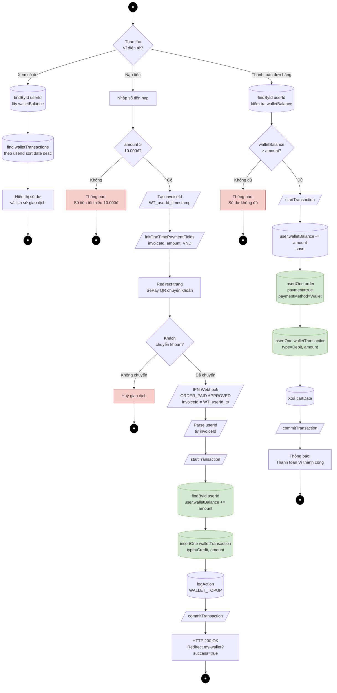

```mermaid
flowchart TD
    Start([●]) --> A{Thao tác\nVí điện tử?}

    %% ===== XEM SỐ DƯ =====
    A -->|Xem số dư| B[(findById userId\nlấy walletBalance)]
    B --> C[(find walletTransactions\ntheo userId sort date desc)]
    C --> D[Hiển thị số dư\nvà lịch sử giao dịch]
    D --> End1([●])

    %% ===== NẠP TIỀN =====
    A -->|Nạp tiền| E[Nhập số tiền nạp]
    E --> F{amount ≥\n10.000đ?}
    F -->|Không| G[Thông báo:\nSố tiền tối thiểu 10.000đ]
    G --> End2([●])
    F -->|Có| H[/Tạo invoiceId\nWT_userId_timestamp/]
    H --> I[/initOneTimePaymentFields\ninvoiceId, amount, VND/]
    I --> J[Redirect trang\nSePay QR chuyển khoản]
    J --> K{Khách\nchuyển khoản?}
    K -->|Không chuyển| L[Huỷ giao dịch]
    L --> End3([●])
    K -->|Đã chuyển| M[/IPN Webhook\nORDER_PAID APPROVED\ninvoiceId = WT_userId_ts/]
    M --> N[/Parse userId\ntừ invoiceId/]
    N --> O[/startTransaction/]
    O --> P[(findById userId\nuser.walletBalance += amount)]
    P --> Q[(insertOne walletTransaction\ntype=Credit, amount)]
    Q --> R[(logAction\nWALLET_TOPUP)]
    R --> S[/commitTransaction/]
    S --> T[HTTP 200 OK\nRedirect my-wallet?success=true]
    T --> End4([●])

    %% ===== THANH TOÁN QUA VÍ =====
    A -->|Thanh toán đơn hàng| U[(findById userId\nkiểm tra walletBalance)]
    U --> V{walletBalance\n≥ amount?}
    V -->|Không đủ| W[Thông báo:\nSố dư không đủ]
    W --> End5([●])
    V -->|Đủ| X[/startTransaction/]
    X --> Y[(user.walletBalance -= amount\nsave)]
    Y --> Z[(insertOne order\npayment=true\npaymentMethod=Wallet)]
    Z --> AA[(insertOne walletTransaction\ntype=Debit, amount)]
    AA --> AB[(Xoá cartData)]
    AB --> AC[/commitTransaction/]
    AC --> AD[Thông báo:\nThanh toán Ví thành công]
    AD --> End6([●])

    %% Styling
    style Start fill:#000,color:#fff,stroke:#000
    style End1 fill:#000,color:#fff,stroke:#fff
    style End2 fill:#000,color:#fff,stroke:#fff
    style End3 fill:#000,color:#fff,stroke:#fff
    style End4 fill:#000,color:#fff,stroke:#fff
    style End5 fill:#000,color:#fff,stroke:#fff
    style End6 fill:#000,color:#fff,stroke:#fff
    style G fill:#f8cecc,stroke:#b85450
    style W fill:#f8cecc,stroke:#b85450
    style L fill:#f8cecc,stroke:#b85450
    style P fill:#d5e8d4,stroke:#82b366
    style Q fill:#d5e8d4,stroke:#82b366
    style Z fill:#d5e8d4,stroke:#82b366
    style AA fill:#d5e8d4,stroke:#82b366
```
