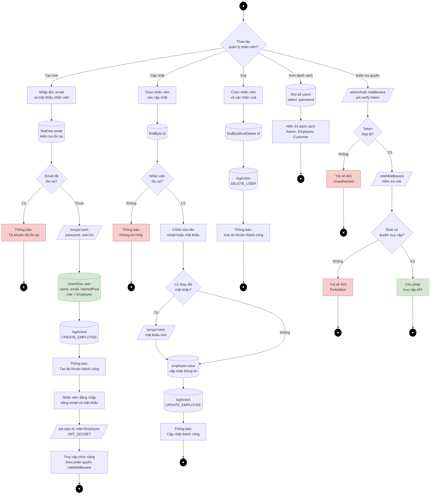

```mermaid
flowchart TD
    Start([●]) --> A{Thao tác\nquản lý nhân viên?}

    %% ===== TẠO NHÂN VIÊN =====
    A -->|Tạo mới| B[Nhập tên, email\nvà mật khẩu nhân viên]
    B --> C[(findOne email\nkiểm tra tồn tại)]
    C --> D{Email đã\ntồn tại?}
    D -->|Có| E[Thông báo:\nTài khoản đã tồn tại]
    E --> End1([●])
    D -->|Chưa| F[/bcrypt.hash\npassword, salt=10/]
    F --> G[(insertOne user\nname, email, hashedPwd\nrole = Employee)]
    G --> H[(logAction\nCREATE_EMPLOYEE)]
    H --> I[Thông báo:\nTạo tài khoản thành công]
    I --> J[Nhân viên đăng nhập\nbằng email và mật khẩu]
    J --> K[/jwt.sign id, role=Employee\nJWT_SECRET/]
    K --> L[Truy cập chức năng\ntheo phân quyền roleMiddleware]
    L --> End2([●])

    %% ===== CẬP NHẬT NHÂN VIÊN =====
    A -->|Cập nhật| M[Chọn nhân viên\ncần cập nhật]
    M --> N[(findById id)]
    N --> O{Nhân viên\ntồn tại?}
    O -->|Không| P[Thông báo:\nKhông tìm thấy]
    P --> End3([●])
    O -->|Có| Q[Chỉnh sửa tên\nemail hoặc mật khẩu]
    Q --> R{Có thay đổi\nmật khẩu?}
    R -->|Có| S[/bcrypt.hash\nmật khẩu mới/]
    S --> T[(employee.save\ncập nhật thông tin)]
    R -->|Không| T
    T --> U[(logAction\nUPDATE_EMPLOYEE)]
    U --> V[Thông báo:\nCập nhật thành công]
    V --> End4([●])

    %% ===== XOÁ NHÂN VIÊN =====
    A -->|Xoá| W[Chọn nhân viên\nvà xác nhận xoá]
    W --> X[(findByIdAndDelete id)]
    X --> Y[(logAction\nDELETE_USER)]
    Y --> Z[Thông báo:\nXoá tài khoản thành công]
    Z --> End5([●])

    %% ===== XEM DANH SÁCH =====
    A -->|Xem danh sách| AA[(find all users\nselect -password)]
    AA --> AB[Hiển thị danh sách\nAdmin, Employee, Customer]
    AB --> End6([●])

    %% ===== PHÂN QUYỀN =====
    A -->|Kiểm tra quyền| AC[/adminAuth middleware\njwt.verify token/]
    AC --> AD{Token\nhợp lệ?}
    AD -->|Không| AE[Trả về 401\nUnauthorized]
    AE --> End7([●])
    AD -->|Có| AF[/roleMiddleware\nkiểm tra role/]
    AF --> AG{Role có\nquyền truy cập?}
    AG -->|Không| AH[Trả về 403\nForbidden]
    AH --> End8([●])
    AG -->|Có| AI[Cho phép\ntruy cập API]
    AI --> End9([●])

    %% Styling
    style Start fill:#000,color:#fff,stroke:#000
    style End1 fill:#000,color:#fff,stroke:#fff
    style End2 fill:#000,color:#fff,stroke:#fff
    style End3 fill:#000,color:#fff,stroke:#fff
    style End4 fill:#000,color:#fff,stroke:#fff
    style End5 fill:#000,color:#fff,stroke:#fff
    style End6 fill:#000,color:#fff,stroke:#fff
    style End7 fill:#000,color:#fff,stroke:#fff
    style End8 fill:#000,color:#fff,stroke:#fff
    style End9 fill:#000,color:#fff,stroke:#fff
    style E fill:#f8cecc,stroke:#b85450
    style P fill:#f8cecc,stroke:#b85450
    style AE fill:#f8cecc,stroke:#b85450
    style AH fill:#f8cecc,stroke:#b85450
    style G fill:#d5e8d4,stroke:#82b366
    style AI fill:#d5e8d4,stroke:#82b366
```
