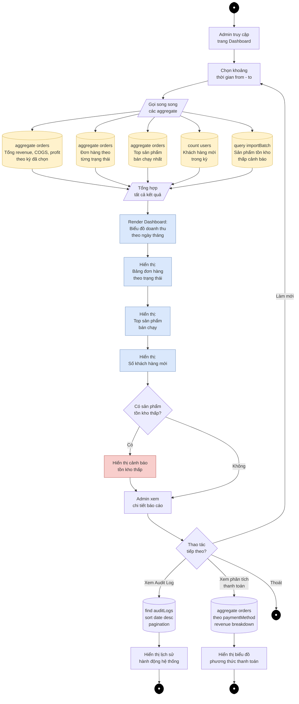

```mermaid
flowchart TD
    Start([●]) --> A[Admin truy cập\ntrang Dashboard]
    A --> B[Chọn khoảng\nthời gian from - to]
    B --> C[/Gọi song song\ncác aggregate/]

    C --> D[(aggregate orders\nTổng revenue, COGS, profit\ntheo kỳ đã chọn)]
    C --> E[(aggregate orders\nĐơn hàng theo\ntừng trạng thái)]
    C --> F[(aggregate orders\nTop sản phẩm\nbán chạy nhất)]
    C --> G[(count users\nKhách hàng mới\ntrong kỳ)]
    C --> H[(query importBatch\nSản phẩm tồn kho\nthấp cảnh báo)]

    D --> I[/Tổng hợp\ntất cả kết quả/]
    E --> I
    F --> I
    G --> I
    H --> I

    I --> J[Render Dashboard:\nBiểu đồ doanh thu\ntheo ngày tháng]
    J --> K[Hiển thị:\nBảng đơn hàng\ntheo trạng thái]
    K --> L[Hiển thị:\nTop sản phẩm\nbán chạy]
    L --> M[Hiển thị:\nSố khách hàng mới]
    M --> N{Có sản phẩm\ntồn kho thấp?}
    N -->|Có| O[Hiển thị cảnh báo\ntồn kho thấp]
    O --> P[Admin xem\nchi tiết báo cáo]
    N -->|Không| P
    P --> Q{Thao tác\ntiếp theo?}
    Q -->|Xem Audit Log| R[(find auditLogs\nsort date desc\npagination)]
    R --> S[Hiển thị lịch sử\nhành động hệ thống]
    S --> End1([●])
    Q -->|Xem phân tích\nthanh toán| T[(aggregate orders\ntheo paymentMethod\nrevenue breakdown)]
    T --> U[Hiển thị biểu đồ\nphương thức thanh toán]
    U --> End2([●])
    Q -->|Làm mới| B
    Q -->|Thoát| End3([●])

    %% Styling
    style Start fill:#000,color:#fff,stroke:#000
    style End1 fill:#000,color:#fff,stroke:#fff
    style End2 fill:#000,color:#fff,stroke:#fff
    style End3 fill:#000,color:#fff,stroke:#fff
    style D fill:#fff2cc,stroke:#d6b656
    style E fill:#fff2cc,stroke:#d6b656
    style F fill:#fff2cc,stroke:#d6b656
    style G fill:#fff2cc,stroke:#d6b656
    style H fill:#fff2cc,stroke:#d6b656
    style O fill:#f8cecc,stroke:#b85450
    style J fill:#dae8fc,stroke:#6c8ebf
    style K fill:#dae8fc,stroke:#6c8ebf
    style L fill:#dae8fc,stroke:#6c8ebf
    style M fill:#dae8fc,stroke:#6c8ebf
```
