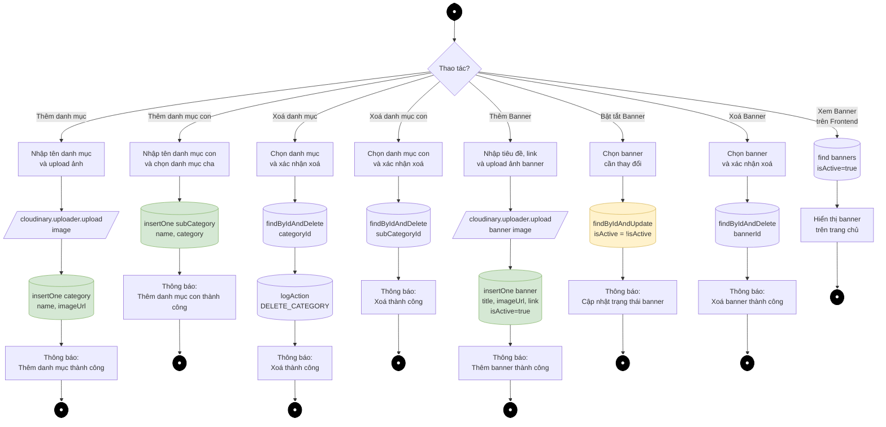

```mermaid
flowchart TD
    Start([●]) --> A{Thao tác?}

    %% ===== DANH MỤC =====
    A -->|Thêm danh mục| B[Nhập tên danh mục\nvà upload ảnh]
    B --> C[/cloudinary.uploader.upload\nimage/]
    C --> D[(insertOne category\nname, imageUrl)]
    D --> E[Thông báo:\nThêm danh mục thành công]
    E --> End1([●])

    A -->|Thêm danh mục con| F[Nhập tên danh mục con\nvà chọn danh mục cha]
    F --> G[(insertOne subCategory\nname, category)]
    G --> H[Thông báo:\nThêm danh mục con thành công]
    H --> End2([●])

    A -->|Xoá danh mục| I[Chọn danh mục\nvà xác nhận xoá]
    I --> J[(findByIdAndDelete\ncategoryId)]
    J --> K[(logAction\nDELETE_CATEGORY)]
    K --> L[Thông báo:\nXoá thành công]
    L --> End3([●])

    A -->|Xoá danh mục con| M[Chọn danh mục con\nvà xác nhận xoá]
    M --> N[(findByIdAndDelete\nsubCategoryId)]
    N --> O[Thông báo:\nXoá thành công]
    O --> End4([●])

    %% ===== BANNER =====
    A -->|Thêm Banner| P[Nhập tiêu đề, link\nvà upload ảnh banner]
    P --> Q[/cloudinary.uploader.upload\nbanner image/]
    Q --> R[(insertOne banner\ntitle, imageUrl, link\nisActive=true)]
    R --> S[Thông báo:\nThêm banner thành công]
    S --> End5([●])

    A -->|Bật tắt Banner| T[Chọn banner\ncần thay đổi]
    T --> U[(findByIdAndUpdate\nisActive = !isActive)]
    U --> V[Thông báo:\nCập nhật trạng thái banner]
    V --> End6([●])

    A -->|Xoá Banner| W[Chọn banner\nvà xác nhận xoá]
    W --> X[(findByIdAndDelete\nbannerId)]
    X --> Y[Thông báo:\nXoá banner thành công]
    Y --> End7([●])

    A -->|Xem Banner\ntrên Frontend| Z[(find banners\nisActive=true)]
    Z --> AA[Hiển thị banner\ntrên trang chủ]
    AA --> End8([●])

    %% Styling
    style Start fill:#000,color:#fff,stroke:#000
    style End1 fill:#000,color:#fff,stroke:#fff
    style End2 fill:#000,color:#fff,stroke:#fff
    style End3 fill:#000,color:#fff,stroke:#fff
    style End4 fill:#000,color:#fff,stroke:#fff
    style End5 fill:#000,color:#fff,stroke:#fff
    style End6 fill:#000,color:#fff,stroke:#fff
    style End7 fill:#000,color:#fff,stroke:#fff
    style End8 fill:#000,color:#fff,stroke:#fff
    style D fill:#d5e8d4,stroke:#82b366
    style G fill:#d5e8d4,stroke:#82b366
    style R fill:#d5e8d4,stroke:#82b366
    style U fill:#fff2cc,stroke:#d6b656
```
