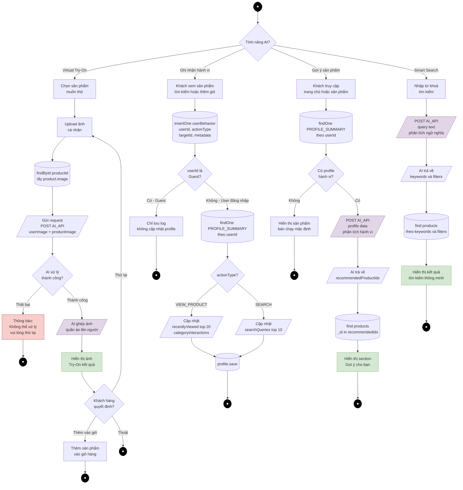

```mermaid
flowchart TD
    Start([●]) --> A{Tính năng AI?}

    %% ===== VIRTUAL TRY-ON =====
    A -->|Virtual Try-On| B[Chọn sản phẩm\nmuốn thử]
    B --> C[Upload ảnh\ncá nhân]
    C --> D[(findById productId\nlấy product.image)]
    D --> E[/Gửi request\nPOST AI_API\nuserImage + productImage/]
    E --> F{AI xử lý\nthành công?}
    F -->|Thất bại| G[Thông báo:\nKhông thể xử lý\nvui lòng thử lại]
    G --> End1([●])
    F -->|Thành công| H[/AI ghép ảnh\nquần áo lên người/]
    H --> I[Hiển thị ảnh\nTry-On kết quả]
    I --> J{Khách hàng\nquyết định?}
    J -->|Thêm vào giỏ| K[Thêm sản phẩm\nvào giỏ hàng]
    K --> End2([●])
    J -->|Thử lại| C
    J -->|Thoát| End3([●])

    %% ===== GHI NHẬN HÀNH VI =====
    A -->|Ghi nhận hành vi| L[Khách xem sản phẩm\ntìm kiếm hoặc thêm giỏ]
    L --> M[(insertOne userBehavior\nuserId, actionType\ntargetId, metadata)]
    M --> N{userId là\nGuest?}
    N -->|Có - Guest| O[Chỉ lưu log\nkhông cập nhật profile]
    O --> End4([●])
    N -->|Không - User đăng nhập| P[(findOne PROFILE_SUMMARY\ntheo userId)]
    P --> Q{actionType?}
    Q -->|VIEW_PRODUCT| R[/Cập nhật\nrecentlyViewed top 20\ncategoryInteractions/]
    Q -->|SEARCH| S[/Cập nhật\nsearchQueries top 10/]
    R --> T[(profile.save)]
    S --> T
    T --> End5([●])

    %% ===== GỢI Ý SẢN PHẨM =====
    A -->|Gợi ý sản phẩm| U[Khách truy cập\ntrang chủ hoặc sản phẩm]
    U --> V[(findOne PROFILE_SUMMARY\ntheo userId)]
    V --> W{Có profile\nhành vi?}
    W -->|Không| X[Hiển thị sản phẩm\nbán chạy mặc định]
    X --> End6([●])
    W -->|Có| Y[/POST AI_API\nprofile data\nphân tích hành vi/]
    Y --> Z[/AI trả về\nrecommendedProductIds/]
    Z --> AA[(find products\n_id in recommendedIds)]
    AA --> AB[Hiển thị section\nGợi ý cho bạn]
    AB --> End7([●])

    %% ===== SMART SEARCH =====
    A -->|Smart Search| AC[Nhập từ khoá\ntìm kiếm]
    AC --> AD[/POST AI_API\nquery text\nphân tích ngữ nghĩa/]
    AD --> AE[/AI trả về\nkeywords và filters/]
    AE --> AF[(find products\ntheo keywords và filters)]
    AF --> AG[Hiển thị kết quả\ntìm kiếm thông minh]
    AG --> End8([●])

    %% Styling
    style Start fill:#000,color:#fff,stroke:#000
    style End1 fill:#000,color:#fff,stroke:#fff
    style End2 fill:#000,color:#fff,stroke:#fff
    style End3 fill:#000,color:#fff,stroke:#fff
    style End4 fill:#000,color:#fff,stroke:#fff
    style End5 fill:#000,color:#fff,stroke:#fff
    style End6 fill:#000,color:#fff,stroke:#fff
    style End7 fill:#000,color:#fff,stroke:#fff
    style End8 fill:#000,color:#fff,stroke:#fff
    style G fill:#f8cecc,stroke:#b85450
    style H fill:#e1d5e7,stroke:#9673a6
    style Y fill:#e1d5e7,stroke:#9673a6
    style AD fill:#e1d5e7,stroke:#9673a6
    style I fill:#d5e8d4,stroke:#82b366
    style AB fill:#d5e8d4,stroke:#82b366
    style AG fill:#d5e8d4,stroke:#82b366
```
